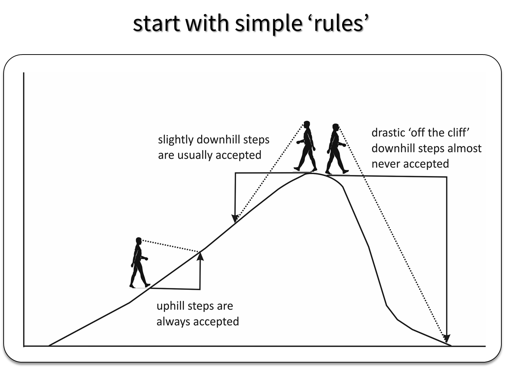

```{r setup, include = FALSE}
# Set up
library(knitr)
library(here)
opts_chunk$set(
  echo = TRUE,
  message = FALSE,
  warning = FALSE)
opts_knit$set(root.dir = here())
```

```{r packages}
# Packages
library(GLMsData)  # datasets voor GLMs
library(tidyverse) # gegevensverwerking en visualisatie
library(brms)      # fitten van Bayesiaanse modellen
library(bayesplot) # MCMC visualisatie en posterior predictive checks
library(tidybayes) # nabewerking en visualisatie van Bayesiaanse modellen

# Conflicten tussen packages
conflicted::conflicts_prefer(dplyr::filter)
conflicted::conflicts_prefer(dplyr::lag)
conflicted::conflicts_prefer(brms::ar)
conflicted::conflicts_prefer(brms::dstudent_t)
conflicted::conflicts_prefer(brms::pstudent_t)
conflicted::conflicts_prefer(brms::qstudent_t)
conflicted::conflicts_prefer(brms::rstudent_t)
conflicted::conflict_prefer("rhat", "brms")
```

# Theoretische achtergrond

## Wat is Bayesiaanse statistiek?

In deze sectie herhalen we kort enkele basisprincipes van Bayesiaanse statistiek. 
We verwijzen ook graag naar het infomoment van 24 oktober 2023 (zie [infomoment 24/10/2023](https://drive.google.com/drive/folders/1MIWu8-LnhTUnKKAchjI7FEmaJ8TN_1mb)).
```{r, purl = FALSE}
data.frame(
  wat = c(
   "interpretatie kans",
   "gebruikte kennis",
   "hypothesetest",
   "terminologie",
   "parameters en data"
  ),
  Frequentist = c(
    "lange termijn relatieve frequentie",
    "enkel data",
    "kans op data die minstens even extreem is als de verzamelde data",
    "p-waarde, confidence interval, type 1 en type 2 fout,...",
    "parameters zijn vast en onbekend, data is random"
  ),
  Bayesiaans = c(
    "relatieve waarschijnlijkheid",
    "data en voorkennis (prior)",
    "kans dat de hypothese klopt",
    "prior, likelihood, posterior, credible interval,...",
    "parameters zijn onzeker en hebben een verdeling, data ligt vast"
  )
) %>%
  kable(booktabs = TRUE, 
        col.names = c("", "Frequentist", "Bayesiaans"))
```


### Statistische inferentie

Stel dat we geïnteresseerd zijn in het aantal soorten mieren dat voorkomt in een onderzoekssite van een vooraf gespecificeerde grootte.
Aantallen worden vaak gespecificeerd door een Poisson verdeling aangezien deze verdeling enkel positieve gehele getallen aanneemt. 

$$ X \sim Poisson(\theta)$$
met $X$ het aantal soorten mieren en $\theta$ de parameter die we willen schatten.
In een Poisson verdeling is er slechts één parameter; $\theta$ is gelijk aan het gemiddelde en de variantie van de verdeling.
We kennen de echte waarde van $\theta$ niet *a priori*. 
Ons model definieert een collectie van waarschijnlijkheidsmodellen (probability models); één voor iedere mogelijke waarde van $\theta$. 
Deze collectie van modellen noemen we de *likelihood*.
In onderstaande figuur tonen we drie voorbeelden van een potentiele likelihood.
Het zijn drie kansdichtheidsfunctie van een Poisson verdelingen met steeds een andere parameter $\theta$.

```{r, purl = FALSE}
likelihood <- data.frame(x = rep(seq(0, 25), 3),
                         theta = c(rep(5, 26), rep(10, 26), rep(15, 26))) %>%
  mutate(prob = stats::dpois(x, lambda = theta),
         theta = as.factor(theta))
likelihood %>%
  ggplot(aes(x = x, y = prob, color = theta)) +
  geom_point() + 
  geom_errorbar(aes(ymin = 0, ymax = prob), width = 0) + 
  xlab("aantal soorten mieren in een site") + 
  ylab("kansdichtheid")
```

Stel dat we op één bepaalde site 8 verschillende soorten mieren vinden.
Onze likelihood leert ons dat er een oneindig aantal waarden zijn voor $\theta$ waarmee we de uitkomst 8 krijgen. 
De figuur hieronder toont dat de kans op $X = 8$ verschillend is in ieder van de drie getoonde likelihoods.

```{r, purl = FALSE}
likelihood %>%
  ggplot(aes(x = x, y = prob, color = theta)) +
  geom_point() + 
  geom_errorbar(aes(ymin = 0, ymax = prob), width = 0) +
  geom_bar(data = likelihood %>% filter(x == 8),
           color = "grey", stat = "identity", alpha = 0.7) + 
  xlab("aantal soorten mieren in een site") + 
  ylab("kansdichtheid") +
  facet_grid(cols = vars(theta))
```

Ieder van deze modellen met steeds een andere waarde van $\theta$ kan ons de waarde van $X=8$ geven.
Bij statistische inferentie willen we de likelihood eigenlijk inverteren door gebruik te maken van onze voorkennis (prior).
Op deze manier hopen we te weten te komen welk model van alle potentiele modellen het meeste zinvol/waarschijnlijk is.
Zowel frequentist als bayesiaanse methoden inverteren in essentie $p(X|\theta) \rightarrow p(\theta|X)$ maar de methode verschilt.


**Frequentist inferentie**

Bij frequentist inferentie definiëren we een hypothese over het data-genererende proces die we willen testen:

-$H_0:$ de hypothese $\theta$ is waar
-$H_1:$ de hypothese $\theta$ is niet waar

De vuistregel in frequentist statistiek is dan:

- als $P($data $X$ of extremer$|\theta) < 0.05$, dan is \theta niet waar  $\Rightarrow  P(\theta|X) = 0$
- als $P($data $X$ of extremer$|\theta) \geq 0.05$, dan zou \theta kunnen waar zijn  $\Rightarrow P(\theta|X) = ?$

In onderstaande figuur staan de volgende kansen afgebeeld:

- $p(X\geq8|\theta = 5)\simeq$ `r 1 - round(likelihood %>% filter(x <= 8 & theta == 5) %>% dplyr::pull(prob) %>% sum(), 3)` Dit is groter dan 0.05 dus we kunnen de hypothese dat $\theta$ gelijk is aan 5 niet verwerpen.
- $p(X\leq8|\theta = 10)\simeq$ `r round(likelihood %>% filter(x <= 8 & theta == 10) %>% dplyr::pull(prob) %>% sum(), 3)` Dit is groter dan 0.05 dus we kunnen de hypothese dat $\theta$ gelijk is aan 10 niet verwerpen.
- $p(X\leq8|\theta = 15)\simeq$ `r round(likelihood %>% filter(x <= 8 & theta == 15) %>% dplyr::pull(prob) %>% sum(), 3)` Dit is kleiner dan 0.05 dus we verwerpen de hypothese dat $\theta$ gelijk is aan 15.

```{r, purl = FALSE}
likelihood %>%
  ggplot(aes(x = x, y = prob, color = theta)) +
  geom_point() + 
  geom_errorbar(aes(ymin = 0, ymax = prob), width = 0) +
  geom_bar(data = likelihood %>%
             filter((x <= 8 & theta %in% c(10,15))|
                      (x >= 8 & theta == 5)),
           color = "grey", stat = "identity", alpha = 0.7) + 
  xlab("aantal soorten mieren in een site") + 
  ylab("kansdichtheid") +
  facet_grid(cols = vars(theta))
```

Als we deze berekeningen herhalen voor verschillende waarden van $\theta$, kunnen we ontdekken dat het 90% confidence interval (5% langs beiden kanten) gelijk is aan $4.0 \leq \theta \leq 14.4$.
De beslissingsruimte voor de parameter $\theta$ wordt dus opgedeeld in twee delen; waarden die waarschijnlijk zijn en waarden die niet waarschijnlijk zijn.

**Bayesiaanse inferentie**

Bij Bayesiaanse inferentie wordt Bayes' rule gebruikt:

$$
p(\theta|X) = \frac{p(X|\theta) * p(\theta)}{p(X)}
$$

Dit zorgt er voor dat we voor iedere potentiele waarde van $\theta$ een waarschijnlijkheid zullen hebben.
De parameters hebben bij Bayesiaanse modellen dus een verdeling.
Dit staat in contrast met frequentist inferentie waar de oplossingsruimte voor $\theta$ opgesplitst wordt in twee delen: waarden die niet of wel waarschijnlijk zijn.

In ons voorbeeld van het aantal soorten mieren is:

- $\theta$ het gemiddelde aantal soorten mieren
- $X$ de data
- $p(X|\theta)$ de *likelihood*
- $p(\theta)$ de *prior*
- De noemer $p(X)$ maakt exacte Bayesiaanse inferentie moeilijk en heeft verschillende interpretaties:
  - Vooraleer we data verzamelen, is dit de *prior predictive distribution*
  - Als we data hebben, is dit een nummer dat de posterior normaliseert. Dit wordt *evidence* of *marginal likelihood* genoemd.
- $p(\theta|X)$ is de *posterior*. Het is een waarschijnlijkheidsverdeling. Deze posterior is het startpunt voor alle verdere analyse in Bayesiaanse inferentie.


Op deze [website](https://iupbsapps.shinyapps.io/KruschkeFreqAndBayesApp/) vind je een mooie illustratie van hoe prior en likelihood gecombineerd worden om tot een posterior te komen ([tutorial](https://jkkweb.sitehost.iu.edu/KruschkeFreqAndBayesAppTutorial.html)).


## Parameterschatting in Bayesiaanse statistiek


Herinner Bayes' rule:
$$
p(\theta|X) = \frac{p(X|\theta) * p(\theta)}{p(X)}
$$

We vermeldden eerder reeds dat de noemer hier heel moeilijk is om te berekenen.
Er zijn twee mogelijke oplossingen:

- *Conjugate priors*: Voor sommige verdelingen en combinaties van priors en likelihoods is het mogelijk om toch een analytische oplossing te krijgen (zie [deze lijst](https://en.wikipedia.org/wiki/Conjugate_prior)). Dit beperkt echter onze mogelijkheden:
  - enkel mogelijk voor enkele univariate en bivariate problemen
  - de conjugate priors beperken de vrijheid om je voorkennis voor te stellen. (bijvoorbeeld zero-inflation, )
- *Sampling*: we krijgen informatie over de verdeling door eruit te samplen in plaats van het exact te berekenen.

## Parameterschatting met MCMC

### Wat is MCMC?

MCMC staat voor 'Monte Carlo' 'Markov Chain'. We gaan niet dieper in op deze begrippen. Gaandeweg wordt wel duidelijk wat hiermee wordt bedoeld.

De posterior distributie kan je vergelijken met een berg. De top van de berg ligt waar de parameterwaarde het meest waarschijnlijk is (maximum likelihood). De ligging en de vorm van de bergtop is echter onbekend. Het doel van een MCMC algortime is op een efficiënte wijze de bergtop en de omgeving te verkennen. 

Een MCMC genereert een reeks van parameterwaarden aan de hand van een aantal regels die de sampler toelaat de hele range van de posterior distributie te exploreren. De regels zorgen ervoor dat de sampler de hele tijd in de buurt van de top van de berg blijft.

Een MCMC is een random wandeling in de parameterruimte in de omgeving waar de posterior distributie het hoogst is (de top van de berg). De grootte en de richting van de stap varieert.

Bij een stap bergop gaat de MCMC altijd door. Is de stap bergaf, dan gaat de MCMC niet altijd door. De kans om bergaf te gaan hangt af van hoe diep de stap naar beneden is. Kleine stapjes naar beneden worden vaak genomen. Bij diepe stappen naar benenden blijft de MCMC meestal staan en kiest de MCMC vervolgens een nieuwe stap.

De absolute hoogte van de berg (posterior likelihood) doet er op zich niet toe. Enkel de relatieve verschillen.



Een eenvoudig MCMC algoritme is het Metropolis algoritme. Het wordt beschreven door deze formele regels:

1. Kies een startwaarde voor de parameter
2. Bereken voor die parameter de posterior likelihood (= prior + likelihood)
3. Kies lukraak een nieuwe parameterwaarde, maar 'in de buurt' van de vorige
4. Bereken de nieuwe posterior voor die nieuwe parameterwaarde
5. Is de likelihood voor de nieuwe posterior > huidige posterior => nieuwe waarde behouden
6. Is de likelihood voor de nieuwe posterior < huidige posterior =>
   a) Bereken de ratio (nieuwe posterior / vorige posterior.
   b) Aanvaard de nieuwe waarde met een kans gelijk aan de ratio. (dus hoe lager de nieuwe likelihood hoe kleiner de kans op aanvaarden. 
7. Doorloop 3 to 6 (enkele duizenden keren).

Het is doordat de kans om parameterwaarden met een lagere likelihood te selecteren varieert met de ratio van de likelihoods dat de MCMC in de limiet (na heel veel iteraties) een correcte afspiegeling is van de posterior distributie. 


Voor eenvoudige gevallen is een MCMC opstellen niet zo complex. Hieronder een eenvoudig voorbeeld.

Een lineaire regressie met twee te schatten parameters:

$$
Y = \beta_0 + \beta_1 * X
$$
$ \beta_0 $ = intercept
$ \beta_1 $ = helling


Stel een dataset met 5 metingen van $X$ met respons $Y$. 
```{r}
y <- c(1.3, 5.2, 9.7, 12.8, 14.9)
x <- c(-2.2, -1.3, 0.3, 2.1, 4.9)
df_data <- data.frame(y = y, x = x)
```

```{r}
ggplot(df_data, aes(x = x, y = y)) + geom_point() + geom_smooth(method = "lm", se = TRUE)
```

Een lineaire regressie met LM geeft:

```{r}
lm1 <- lm(formula = y ~ x, data = df_data)
summary(lm1)
# output beperken
```

Met betrouwbaarheidsinterval
```{r}
confint(lm1)
```

We lezen enkele korte functies in om de (log) likelihood voor dit model te berekenen en het MCMC metropolis algoritme uit te voeren.

```{r}
source(file = "./source/mcmc_functions.R")
```

Vermits het een eenvoudig model is met een kleine dataset, kunnen we de posterior likelihood voor een groot aantal verschillende combinaties uitrekenen

```{r}
df <- expand.grid(a = seq(-1, 15, 0.5), b = seq(-3, 8, 0.5))
df$post <- NA
for (i in 1:nrow(df)) {
  df[i,"post"] <- ll.fun(a = df[i,1], b = df[i,2]) +
    prior.fun(a = df[i,1], b = df[i,2])
}
```

```{r}
ggplot(df, aes(x = a, y = b, z = post)) +
  geom_raster(aes(fill = post)) + geom_contour(colour = "black") +
  scale_fill_gradientn(colours = rainbow(n = 4))
```

We kiezen nu een startwaarde voor $ \beta_0 $  en $\beta_1$ 
```{r}
beta_0 <- 12
beta_1 <- 6
```

```{r}
mcmc_small <- MCMC_metro(x = x, y = y, N = 100,
                         sigma = 1,
                         init_a = beta_0, init_b = beta_1)
```

```{r}
ggplot(df, aes(x = a, y = b, z = post)) +
  geom_raster(aes(fill = post)) + geom_contour(binwidth = 20, colour = "black") +
  scale_fill_gradientn(colours = rainbow(n = 4)) +
  geom_path(data = mcmc_small, aes(x = a, y = b, z = NA), colour = "black") +
  geom_point(data = mcmc_small, aes(x = a, y = b, z = NA), colour = "red") +
  coord_cartesian(xlim = c(-1, 14.5), ylim = c(-3, 7)) +
  theme(legend.position="none")
```

De startwaarde ligt ver van de maximale likelihood. Het duurt even voor de MCMC stabiliseert in de omgeving van de top van de berg. Daarom wordt het eerste deel van de MCMC nooit gebruikt. Dit is de 'burn-in'.

```{r}
mcmc <- MCMC_metro(x = x, y = y, N = 5000, sigma = 1, init_a = 12, init_b = 6)
```

```{r}
p1 <- ggplot(df, aes(x = a, y = b, z = post)) +
  geom_raster(aes(fill = post)) + geom_contour(binwidth = 20, colour = "black") +
  scale_fill_gradientn(colours = rainbow(n = 4)) +
  geom_path(data = mcmc, aes(x = a, y = b, z = NA), colour = "black") +
  geom_point(data = mcmc, aes(x = a, y = b, z = NA), colour = "red") +
  coord_cartesian(xlim = c(-1, 14.5), ylim = c(-3, 7)) +
  theme(legend.position="none")

p2 <- ggplot(data = mcmc, aes(x = a)) + geom_histogram(bins = 50) +
  geom_vline(xintercept = quantile(mcmc$a, probs = c(0.05, 0.5, 0.95)), colour = "red") +
  scale_x_continuous(limits = c(-1, 14.5), breaks = seq(-1, 14.5, 1)) +
  theme(axis.title.x = element_blank())

p3 <- ggplot(data = mcmc, aes(x = b)) + geom_histogram(bins = 50) +
  geom_vline(xintercept = quantile(mcmc$b, probs = c(0.05, 0.5, 0.95)), colour = "red") +
  coord_flip() + scale_x_continuous(limits = c(-3, 7), breaks = seq(-3, 7, 1)) +
  theme(axis.title.y = element_blank())

empty <- ggplot()

gridExtra::grid.arrange(p2, ggplot(), p1, p3, ncol = 2, nrow = 2, widths=c(4, 1), heights=c(1, 4))

```

Trace plot

```{r}
mcmc %>% 
  ggplot(aes(x = iter, y = a)) + geom_line()
```


Thinning

Parallel chains

 https://nicercode.github.io/guides/mcmc/

Er bestaan heel wat meer gesofesticeerde samplers zoals WinBugs, Jags, Stan, ..., maar het principe is bij MCMC is steeds hetzelfde. 

Het package 'brms' gebruikt standaard de stan sampler.


Zodra we de posterior kennen, zijn er in Bayesiaanse inferentie verschillende mogelijkheden voor puntschattingen (zie ook figuren hieronder):

- het posterior gemiddelde
- de posterior mediaan
- maximum a posteriori (MAP) oftewel de mode. De mode kan soms ver van het gemiddelde en de mediaan liggen.

Ook voor de weergave van onzekerheid zijn er verschillende opties:

- Highest posterior density interval (HPDI): dit is interessant als het bijvoorbeeld belangrijk is om regio's met een lage densiteit te vermijden.
- Equal-tailed credible interval = Central posterior interval (CPI): Voor de berekening van een $100*(1-\alpha)$% interval, zal er $\frac{\alpha}{2}$ waarschijnlijkheid in zowel de linker als rechter "staart" van de verdeling zitten.

Bij symmetrische, unimodale verdelingen zijn HPDI en CPI hetzelfde (zie eerste figuur hieronder).
Anders kan er best wel wat verschil zitten tussen beide intervallen (zie figuur 2 en 3 hieronder).

```{r, purl = FALSE}
# specify a unimodal, symmetric distribution
unimodal <- data.frame(
  x = seq(10, 50)
) %>%
  mutate(prob = dnorm(x, mean = 30, sd = 5),
        cum_sum = pnorm(x, mean = 30, sd = 5))
limits <- data.frame(type = c("CPI", "CPI", "HPDI", "HPDI"),
                     x = c(13, 46, 13, 46))

p1 <- ggplot(unimodal) +
  geom_line(aes(x = x, y = prob)) +
  geom_vline(data = limits, aes(xintercept = x, color = type, lty = type),
             alpha = 0.5)

# specify a bimodal distribution
bimodal <- data.frame(
  x = seq(0, 50, 0.1)
) %>%
  mutate(prob = (dnorm(x, mean = 32, sd = 4) +
           dnorm(x, mean = 12, sd = 2))/2,
        cum_sum = (pnorm(x, mean = 32, sd = 4) + pnorm(x, mean = 12, sd = 2))/2)
measures <- data.frame(measures = c("mean", "mode", "median"),
                       x = c(weighted.mean(x = bimodal$x, w = bimodal$prob),
                             12, 18.7))
limits <- data.frame(type = c("CPI", "CPI", "HPDI", "HPDI", "HPDI", "HPDI"),
                     x = c(9.5, 37, 7.9, 16.1, 25.4, 38.5))
p2 <- ggplot(bimodal) +
  geom_vline(data = limits %>% filter(type == "HPDI"), aes(xintercept = x)) +
  geom_bar(data = bimodal %>%
             filter((x >= 7.9 & x <= 16.1) | (x >= 25.4 & x <= 38.5)),
           aes(x = x, y = prob),
           stat = "identity", color = "grey", fill = "grey") +
  ggtitle("highest posterior density interval for a bimodal distribution") +
  geom_line(aes(x = x, y = prob)) + 
  geom_vline(data = measures, aes(xintercept = x), color = "red") +
  geom_text(data = measures,
            aes(label = measures, x = x, y = c(0.1, 0.09, 0.08)), color = "red")
p3 <- ggplot(bimodal) +
  geom_vline(data = limits %>% filter(type == "CPI"), aes(xintercept = x)) +
  geom_bar(data = bimodal %>% filter(x >= 9.5 & x <= 37),
           aes(x = x, y = prob),
           stat = "identity", color = "grey", fill = "grey") +
  ggtitle("equal tail credible interval for a bimodal distribution") +
  geom_line(aes(x = x, y = prob))
p1 
```

```{r, purl = FALSE}
p2
```
```{r, purl = FALSE}
p3
```


## Hypotheses testen
Bayes' factor

# Een model fitten met brms


## Dataset laden en data exploratie

We laden een dataset in over het aantal mierensoorten in New England (USA). Typ `?ants` in de console voor meer info.

```{r data-expl-laad-data}
# Laad dataset in
data(ants)

# Maak kopie met kolomnamen in kleine letters
ants_df <- ants %>%
  rename(sp_rich = Srich) %>%
  rename_with(tolower)

# Hoe zien de data eruit?
glimpse(ants_df)
```

We hebben een aantal sites (`site`) waar het aantal soorten mieren geteld zijn (`sp_rich`). Enkele variabelen zijn aanwezig: `habitat`, `latitude` en hoogte (`elevation`). We bekijken enkele samenvattende statistieken. In elke site zijn 2 tellingen gedaan: in moeras (`bog`) en in bos (`forest`).


```{r data-expl-summary}
# Samenvattende statistieken dataset
summary(ants_df)
```

We visualiseren de data.


```{r data-expl-vis1}
# Frequentie aantal soorten per habitat
ants_df %>%
  ggplot(aes(x = sp_rich)) +
    geom_bar() +
    scale_x_continuous(limits = c(0, NA)) +
    facet_wrap(~habitat)
```


```{r data-expl-vis2}
# Boxplots aantal soorten per habitat
ants_df %>%
  ggplot(aes(y = sp_rich, x = habitat)) +
    geom_boxplot() +
    geom_line(aes(colour = site, group = site), alpha = 0.5) +
    geom_point(aes(colour = site, group = site)) +
    scale_y_continuous(limits = c(0, NA))
```

```{r data-expl-vis3}
# Scatter plot aantal soorten en latitude per habitat

ants_df %>%
  ggplot(aes(y = sp_rich, x = latitude)) +
    geom_point() +
    geom_smooth(method = "loess", formula = "y ~ x", colour = "firebrick") +
    facet_wrap(~habitat)
```

```{r data-expl-vis4}
# Scatter plot aantal soorten en hoogte per habitat

ants_df %>%
  ggplot(aes(y = sp_rich, x = elevation)) +
    geom_point() +
    geom_smooth(method = "loess", formula = "y ~ x", colour = "firebrick") +
    facet_wrap(~habitat)
```

Als oefening zullen we een model maken om het aantal soorten te vergelijken tussen beide habitats. Uit de data exploratie zagen we al dat het aantal hoger lijkt te liggen in bossen en dat sites met een hoger aantal in moerassen vaak ook een hoger aantal in bossen hebben.

## Specificatie van een lineaire regressie

### Model specificatie

We willen een model waarmee we het verschil kunnen onderzoeken in aantal soorten mieren tussen moeras- en boshabitats. Beschouw de responsvariabele $Y$, het aantal mieren, en $X_{habitat}$, een dummy variabele die gelijk is aan 0 voor moerassen en 1 voor bossen. We veronderstellen dat $Y$ een Normaal verdeling volgt (equivalent aan een lineaire regressie met categorische variabele (= ANOVA))

$$
Y \sim N(\mu, \sigma^2)
$$

met

$$
\mu = \beta_0 + \beta_1X_{habitat}
$$

We moeten dus drie parameters schatten: $\beta_0$, $\beta_1$ en $\sigma$. Hoe specificeren we dit in **brms**?

Eerst en vooral besluiten we welke MCMC parameters we zullen gebruiken. Typ `?brm` om te zien wat de standaard instellingen zijn voor deze parameters. Aangeraden is om meerdere chains te gebruiken (`nchains`) en deze parallel te laten lopen op verschillende cores van je computer (`nparallel`). Aangezien dat dit een relatief simpel model is, hebben we niet veel iteraties nodig en geen verdunning.


```{r simpel-model-mcmc-par}
# Instellen MCMC parameters
nchains <- 3           # aantal chains
niter <- 2000          # aantal iteraties (incl. burn-in, zie volgende)
burnin <- niter / 4    # aantal initiële samples om te verwijderen (= burn-in)
nparallel <- nchains   # aantal cores voor parallel computing
thinning <- 1          # verdunningsfactor (hier 1 = geen verdunning)
```

Het model wordt gefit a.d.h.v. de `brm()` functie. De syntax is zeer gelijkaardig aan functies die in frequentist statistics worden gebruikt zoals `lm()` en `glm()`. De `brm()` functie bevat heel wat argumenten (zie `?brm`). Handige argumenten die we hier niet gebruiken zijn bijvoorbeeld:

-   `inits` om de beginwaarden van MCMC algoritme in te stellen. Indien deze niet gespecificeerd zijn, gebruikt de functie default waarden.
-   `prior` om prior distributies te voorzien. Indien deze niet gespecificeerd zijn, gebruikt de functie default (niet informatieve) priors. Het argument `sample_prior` kan gebruikt worden om van de prior te samplen zodat je kan visualiseren of de gebruikte prior voldoet aan je verwachtingen.
-   `file` en `file_refit` om het model object op te slaan nadat het gefit is. Als je de code opnieuw runt en het model is al eens opgeslaan, dan zal `brm()` dit model gewoon inladen in plaats van het opnieuw te fitten.


```{r simpel-model-fit-poisson}
# Fit Normaal model
fit_normal1 <- brm(
  formula = sp_rich ~ habitat, # beschrijving van het model
  family = gaussian(),         # we gebruiken de Normaal verdeling
  data = ants_df,              # ingeven data
  chains = nchains,            # MCMC parameters
  warmup = burnin, 
  iter = niter,
  cores = nparallel,
  thin = thinning,
  seed = 123)                  # seed voor reproduceerbare uitkomst
```

Voor we de resultaten bekijken, controleren we eerst of het model goed convergeert.

### MCMC convergentie

Er zijn verschillende manieren om convergentie van het MCMC algoritme voor elke parameter te controleren. Hierbij worden de burn-in samples niet in rekening genomen. Eerst en vooral heb je *visuele controles*.

We kunnen de MCMC samples met de `as_draws()` functies verkrijgen ofwel ineens visualiseren via de [bayesplot](https://mc-stan.org/bayesplot/) package die compatibel is met brmsfit objecten.


```{r simpel-model-colorscheme}
# Zet kleurenpallet voor duidelijke visualisatie in bayesplot
color_scheme_set("mix-blue-red")
```

```{r}
# Welke parameters gaan we bekijken?
parameters <- c("b_Intercept", "b_habitatForest", "sigma")
```

**trace plot**

Trace plots geven aan hoe het samplen van de posterior distribution verloopt over de tijd. Het idee is dat elke chain convergeert naar dezelfde distributie voor elke parameter (we spreken van mixing). Als deze plot eruit ziet als een harige rups ('fuzzy caterpillar'), wil dit zeggen dat de convergentie goed is.

```{r}
# Visualisatie door extractie samples met as_draws_df()
as_draws_df(fit_normal1, variable = parameters) %>%
  # zet om naar lang formaat voor visualisatie
  pivot_longer(cols = all_of(parameters), names_to = "parameter",
               values_to = "value") %>%
  # visualiseer met ggplot()
  ggplot(aes(y = value, x = .iteration, colour = factor(.chain))) +
    geom_line() +
    facet_wrap(~parameter, nrow = 3, scales = "free")
```

```{r simpel-model-trace}
# Visualisatie via Bayesplot package
mcmc_trace(fit_normal1, pars = parameters)
```

**running mean/quantile/... plot**

Naast een trace plot, kunnen we ook kijken hoe bepaalde statistieken zoals het gemiddelde of de kwantielen variëren over de tijd (= met toename aantal iteraties). Je wilt natuurlijk dat deze statistieken stabiliseren na een aantal iteraties want dan weet je dat je genoeg iteraties gebruikt hebt.

```{r simpel-model-posterior-density}
# code om cumulatieve kwantielen te berekenen
# bron: https://rdrr.io/cran/cumstats/src/R/cumquant.R
cumquant <- function(x, p) {
  out <- sapply(seq_along(x),
                function(k, z) quantile(z[1:k], probs = p[1], names = FALSE),
                z = x)
  return(out)
}
```

```{r}
# Extractie samples en bereken cummulatieve statistieken
as_draws_df(fit_normal1, variable = parameters) %>%
  mutate(across(all_of(parameters), ~cummean(.x),
                .names = "{.col}_gemiddelde"),
         across(all_of(parameters), ~cumquant(.x, 0.1),
                .names = "{.col}_q10"),
         across(all_of(parameters), ~cumquant(.x, 0.9),
                .names = "{.col}_q90")) %>%
  select(-all_of(parameters)) %>%
  # zet om naar lang formaat voor visualisatie
  pivot_longer(cols = starts_with(parameters), names_to = "name",
               values_to = "value") %>%
  # splits naam kolom op bij laatste underscore
  extract(name, into = c("parameter", "statistiek"), "(.*)_([^_]+)$") %>%
  ggplot(aes(y = value, x = .iteration, colour = factor(.chain))) +
    geom_line(aes(linetype = statistiek), linewidth = 0.8) +
    facet_wrap(~parameter, nrow = 3, scales = "free")
```

**posterior density plot**

De vorm van de posterior distributions kan ook informatief zijn om na te kijken of de chains geconvergeerd zijn naar dezelfde distributies. Als we een bimodale verdeling zien (een kamelenrug met twee pieken), dan zou er mogelijks ook iets mis kunnen zijn met de specificatie van ons model.

```{r}
# Visualisatie via Bayesplot package
mcmc_dens_overlay(fit_normal1, pars = parameters)
```

Nog eenvoudiger is de `plot()` functie gebruiken op het brmsfit object. Deze toont direct de trace plots en de posterior density plots naast elkaar voor elke parameter.

```{r}
plot(fit_normal1)
```

**autocorrelation plot**

> uitleg Wat is autocorrelatie? thinning


```{r simpel-model-rhat}
# Visualisatie via Bayesplot package
mcmc_acf(fit_normal1, pars = parameters)
```

**cross-correlation plot**

> uitleg Wat is cross-correlatie?

```{r}
# Visualisatie via Bayesplot package
mcmc_pairs(fit_normal1, pars = parameters,
           off_diag_args = list(size = 1.5))
```

Naast visuele checks zijn er ook *diagnostische controles*.

**Gelman-Rubin diagnostic**

Ook wel $\hat{R}$ (R-hat) of potential scale reduction factor genoemd. Een manier om te controleren of een chain is geconvergeerd, is door zijn gedrag te vergelijken met andere willekeurig geïnitialiseerde ketens. De $\hat{R}$ statistiek neemt de verhouding van de gemiddelde variantie van samples binnen elke chain tot de variantie van de gepoolde samples over alle chains heen. Als alle ketens convergeren naar een gemeenschappelijke distributie, zullen deze verhoudingen gelijk aan 1 zijn. Als de ketens niet zijn geconvergeerd naar een gemeenschappelijke verdeling, zal de $\hat{R}$ statistiek groter zijn dan 1. We kunnen de $\hat{R}$ statistieken extraheren via de `rhat()` functie en dan eventueel visualiseren met de `mcmc_rhat()` functie van de **bayesplot** package.

```{r}
# Krijg R-hats
rhats_fit_normal1 <- rhat(fit_normal1)[parameters]
print(rhats_fit_normal1)
```

```{r}
# Plot R-hats via Bayesplot package
mcmc_rhat(rhats_fit_normal1) + yaxis_text(hjust = 1)
```

**effective sample size**

De effective sample size ($n_{eff}$) is een schatting van het aantal onafhankelijke trekkingen van de posterior distribution van elke parameter. Omdat de trekkingen binnen een Markov chain niet onafhankelijk zijn als er sprake is van autocorrelatie, is de effective sample size gewoonlijk kleiner dan de totale steekproefomvang, namelijk het aantal iteraties ($N$). Hoe groter de verhouding $n_{eff}/N$ hoe beter. De **bayesplot** package biedt een `neff_ratio()` extractorfunctie. De `mcmc_neff()` functie kan vervolgens worden gebruikt om de verhoudingen te plotten.

```{r}
# Krijg verhoudingen
ratios_fit_normal1 <- neff_ratio(fit_normal1)[parameters]
print(ratios_fit_normal1)
```

```{r}
# Plot verhoudingen via Bayesplot package
mcmc_neff(ratios_fit_normal1) + yaxis_text(hjust = 1)
```

Andere packages die van pas kunnen komen bij het controleren van MCMC convergentie zijn [mcmcplots](https://cran.r-project.org/web/packages/mcmcplots/index.html) en [coda](https://cran.r-project.org/web/packages/coda/index.html). Voor deze packages moet je de MCMC samples uit je **brms** model wel eerst omzetten naar een mcmc object.

```         
# voorbeeld
install.packages(mcmcplots)
mcmcplots::mcmcplot(as.mcmc(fit_normal1, pars = parameters))
```

We kunnen over het algemeen besluiten dat MCMC convergentie goed is voor alle parameters. Indien dit niet het geval zou zijn, kan het zijn dat de MCMC parameters anders moeten gekozen worden, bijvoorbeeld door het aantal iteraties te verhogen. Nu we weten dat de parameters correct geschat zijn, kunnen we controleren of het model goed bij de data past.

### Model fit

De [posterior predictive check](https://mc-stan.org/bayesplot/articles/graphical-ppcs.html) (PPC) is een goede manier om te controleren of het model goed past bij de data. Het idee achter de PPC is dat, als een model goed past, de voorspelde waardes o.b.v. het model veel lijken op de data die we hebben gebruikt om het model te fitten. Om de voorspellingen te genereren die worden gebruikt voor PPCs, simuleren we vanuit de posterior predictive distribution (de posterior distribution van de responsvariabele). Visualisatie kan met de **bayesplot** package. De dikke lijn toont de data en de dunne lijntjes tonen verschillende simulaties o.b.v. het model.

```{r}
# Visualiseer model fit via Bayesplot package
pp_check(fit_normal1, type = "dens_overlay_grouped", ndraws = 100, 
         group = "habitat")
```

We zien dat de geobserveerde data en de voorspellingen o.b.v. ons model niet helemaal overeenkomen. Mogelijks was onze keuze voor de Normaal verdeling niet goed. Aantallen zijn discrete, positieve waarden, terwijl de Normaal verdeling continue en zowel positieve als negatieve waarden kan voorspellen. De Poisson verdeling is een discrete verdeling die steeds positief is. Ze wordt vaak gebruikt voor het modelleren van geregistreerde aantallen gedurende een gegeven tijdsinterval, afstand, oppervlakte, volume ...

**Opmerking:**

Merk op dat MCMC convergentie en model fit twee verschillende dingen zijn. Het is niet omdat MCMC convergentie goed is dat model fit ook goed is. MCMC convergentie is om na te gaan of het MCMC algoritme de distributies van de parameters goed heeft kunnen benaderen. Model fit controleert of het model dat door ons aangenomen is (assumptie normaliteit, lineair verband gemiddelde ...) goed past bij de data.

## Specificatie van een Poisson model

### Model specificatie

We veronderstellen dat $Y$ nu een Poisson verdeling volgt

$$
Y \sim Pois(\lambda)
$$

met

$$
\ln(\lambda) = \beta_0 + \beta_1X_{habitat}
$$

We moeten dus twee parameters schatten: $\beta_0$ en $\beta_1$ We gebruiken dezelfde MCMC parameters als voordien. Het enige wat we moeten aanpassen is de keuze `family = poisson()`.

```{r}
# Fit Poisson model
fit_poisson1 <- brm(
  formula = sp_rich ~ habitat, # beschrijving van het model
  family = poisson(),          # we gebruiken de Poisson verdeling
  data = ants_df,              # ingeven data
  chains = nchains,            # MCMC parameters
  warmup = burnin, 
  iter = niter,
  cores = nparallel,
  thin = thinning,
  seed = 123)                  # seed voor reproduceerbare uitkomst
```

### MCMC convergentie

Convergentie ziet er opnieuw goed uit.

```{r}
# Visualiseer MCMC convergentie
plot(fit_poisson1)
```

```{r}
# Extraheer en visualiseer R-hat waarden
rhats_fit_poisson1 <- rhat(fit_poisson1)[c("b_Intercept", "b_habitatForest")]
mcmc_rhat(rhats_fit_poisson1) + yaxis_text(hjust = 1)
```

### Model fit

We zien dat alle predicties nu wel positief zijn, maar de fit is nog altijd niet ideaal.

```{r}
# Visualiseer model fit via Bayesplot package
pp_check(fit_poisson1, type = "dens_overlay_grouped", ndraws = 100, 
         group = "habitat")
```

### Discussie

Hoe kunnen we model fit nog verbeteren?

We weten dat elke site 2x bezocht is. Eenmaal in moeras en eenmaal in bos. Het is natuurlijk mogelijk dat het aantal mieren in het moeras en het bos van dezelfde site gecorreleerd zullen zijn (site effect). Dit zagen we inderdaad ook in de data exploratie. Sites met een hoger aantal soorten in moerassen hebben vaak ook een hoger aantal in bossen en vice versa. Hiervoor kunnen we corrigeren door een random intercept voor elke site toe te voegen `... + (1|site)`.

We veronderstellen dat het aantal soorten $Y$ per site $j$ ($j = 1, ..., J$) een Poisson verdeling volgt

$$
Y_j \sim Pois(\lambda_j)
$$

zodat

$$
\ln(\lambda_j) = \beta_0 + \beta_1X_{habitat} + b_{0,j}
$$

met

$$
b_0 \sim N(0, \sigma_b)
$$

```{r}
# Fit Poisson model met random intercepten per site
fit_poisson2 <- brm(
  formula = sp_rich ~ habitat + (1|site),
  family = poisson(),
  data = ants_df,
  chains = nchains,
  warmup = burnin, 
  iter = niter,
  cores = nparallel,
  thin = thinning,
  seed = 123)
```

Convergentie is goed.

```{r}
# Visualiseer MCMC convergentie
plot(fit_poisson2)
```

```{r}
# Extraheer en visualiseer R-hat waarden
parameters2 <- c("b_Intercept", "b_habitatForest", "sd_site__Intercept")
rhats_fit_poisson2 <- rhat(fit_poisson2)[parameters2]
mcmc_rhat(rhats_fit_poisson2) + yaxis_text(hjust = 1)
```

Model fit lijkt nu nog beter.

```{r}
# Visualiseer model fit via Bayesplot package
pp_check(fit_poisson2, type = "dens_overlay_grouped", ndraws = 100, 
         group = "habitat")
```

Hoe kunnen we deze modellen nu objectief gaan vergelijken?

# Vergelijken van modellen

Op basis van de PPCs kunnen we reeds zien welk model het best past bij de data. Verder zijn er nog enkele functies die **brms** voorziet om verschillende modellen te vergelijken. Met de functie `add_criterion()` kan je model fit criteria toevoegen aan model objecten. Typ `?add_criterion()` om te zien welke beschikbaar zijn. Zie ook <https://mc-stan.org/loo/articles/online-only/faq.html>

## Leave-one-out cross-validation

Cross-validation (CV) is een familie van technieken die probeert in te schatten hoe goed een model onbekende data zou voorspellen via predicties van het model gefit op de bekende data. Hiervoor moet je niet per se nieuwe data gaan inzamelen. Je kan jouw eigen data opsplitsen in een test en training dataset. Je fit het model op de training dataset en je gebruikt dat model dan om te schatten hoe goed het de data in de test dataset kan voorspellen. Bij leave-one-out CV (LOOCV) ga je telkens één observatie weglaten en het model opnieuw fitten o.b.v. alle andere observaties.

```{r}
# Voeg leave-one-out model fit criterium toe aan model objecten
fit_normal1 <- add_criterion(fit_normal1,
                             criterion = c("loo"))
fit_poisson1 <- add_criterion(fit_poisson1,
                              criterion = c("loo"))
fit_poisson2 <- add_criterion(fit_poisson2,
                              criterion = c("loo"))
```

Om het verschil tussen de voorspelling van het model o.b.v. de training dataset te vergelijken met de weggelaten data, moeten we een zgn. utitily of loss function definiëren. Wij gebruiken hier de 'expected log pointwise predictive density' (ELPD). Voor deze workshop is het vooral van belang te beseffen dat dit een maat is voor hoe goed jouw Bayesiaanse model nieuwe datapunten voorspelt. Het wordt berekend door de log-likelihood van elk datapunt te nemen uit de posterior predictive distribution van je model en deze vervolgens uit te middelen. Een hogere ELPD duidt op een betere model fit en voorspellende nauwkeurigheid. Voor deze workshop is het vooral van belang te beseffen dat dit een maat is voor hoe goed het model onbekende data kan voorspellen (`elpd_loo` en de standaard error `se_elpd_loo`). `p_loo` is een maat voor de complexiteit van het model. $\text{looic} = -2*\text{elpd_loo}$ Met de functie `loo_compare()` kan je meerdere modellen vergelijken en wordt ook het verschil in ELPD berekend.

```{r}
# Maak vergelijking leave-one-out cross-validation en print
comp_loo <- loo_compare(fit_normal1, fit_poisson1, fit_poisson2,
                        criterion = "loo")
print(comp_loo, simplify = FALSE, digits = 3)
```

Als je ervan uitgaat dat dit verschil normaal verdeeld is, kan je met de onzekerheid een betrouwbaarheidsinterval berekenen. We zien dat het tweede Poisson model het best scoort en dat de andere modellen significant lager scoren.

```{r}
# Bereken betrouwbaarheidsinterval om modellen te vergelijken
comp_loo %>%
  as.data.frame() %>%
  select(elpd_diff, se_diff) %>%
  mutate(ll_diff = elpd_diff  + qnorm(0.025) * se_diff,
         ul_diff = elpd_diff  + qnorm(0.975) * se_diff)
```

## K-fold cross-validation

Bij K-fold cross-validation worden de data in $K$ groepen opgesplitst. Wij zullen hier $K = 10$ groepen (= folds) gebruiken. In plaats van dus telkens één enkele observatie weg te laten zoals bij leave-one-out CV gaan we hier $1/10$e van de data weglaten. Via de argumenten `folds = "stratified"` en `group = "habitat"` zorgen we ervoor dat voor elke groep de relatieve frequenties van habitat bewaard blijven. Deze techniek zal dus minder precies zijn dan de vorige, maar zal sneller zijn om te berekenen indien je met heel veel data werkt.

```{r}
# Voeg K-fold model fit criterium toe aan model objecten
fit_normal1 <- add_criterion(fit_normal1,
                             criterion = c("kfold"),
                             K = 10,
                             folds = "stratified",
                             group = "habitat")
fit_poisson1 <- add_criterion(fit_poisson1,
                              criterion = c("kfold"),
                              K = 10,
                              folds = "stratified",
                              group = "habitat")
fit_poisson2 <- add_criterion(fit_poisson2,
                              criterion = c("kfold"),
                              K = 10,
                              folds = "stratified",
                              group = "habitat")
```

We krijgen dezelfde statistieken terug als voordien.

```{r}
# Maak vergelijking k-fold cross-validation en print
comp_kfold <- loo_compare(fit_normal1, fit_poisson1, fit_poisson2,
                          criterion = "kfold")
print(comp_kfold, simplify = FALSE, digits = 3)
```

De resultaten zijn hetzelfde, maar de verschillen zijn iets kleiner als voordien. Het verschil tussen de twee Poisson modellen is niet meer significant.

```{r}
# Bereken betrouwbaarheidsinterval om modellen te vergelijken
comp_kfold %>%
  as.data.frame() %>%
  select(elpd_diff, se_diff) %>%
  mutate(ll_diff = elpd_diff  + qnorm(0.025) * se_diff,
         ul_diff = elpd_diff  + qnorm(0.975) * se_diff)
```

## WAIC

Het Widely Applicable Information Criterion (WAIC) maakt geen gebruik van cross-validation maar is een computationele manier om de ELPD te schatten. Hoe dit precies gebeurt valt buiten het doel van deze workshop. Het is nog een andere maat om model selectie toe te passen.

```{r}
# Voeg WAIC model fit criterium toe aan model objecten
fit_normal1 <- add_criterion(fit_normal1,
                             criterion = c("waic"))
fit_poisson1 <- add_criterion(fit_poisson1,
                              criterion = c("waic"))
fit_poisson2 <- add_criterion(fit_poisson2,
                              criterion = c("waic"))
```

We krijgen opnieuw gelijkaardige resultaten als voordien.

```{r}
# Maak vergelijking waic en print
comp_waic <- loo_compare(fit_normal1, fit_poisson1, fit_poisson2,
                         criterion = "waic")
print(comp_waic, simplify = FALSE, digits = 3)
```

```{r}
# Bereken betrouwbaarheidsinterval om modellen te vergelijken
comp_waic %>%
  as.data.frame() %>%
  select(waic, elpd_diff, se_diff) %>%
  mutate(ll_diff = elpd_diff  + qnorm(0.025) * se_diff,
         ul_diff = elpd_diff  + qnorm(0.975) * se_diff)
```

## Conclusie

Zowel o.b.v. de PPC als vergelijkingen met verschillende model selectie criteria, kunnen we besluiten dat het tweede Poisson model met random intercepts het best past bij de data. In principe konden we dit ook verwachten op basis van onze eigen intuïtie en het design van de studie, nl. het gebruik van de Poisson distributie om aantallen te modelleren en het gebruik van random intercepts om te controleren voor een hiërarchisch design (habitats genest in sites).

# Resultaten finale model

Als we het model fit object bekijken, zien we resultaten die vergelijkbaar zijn met resultaten zoals we die zien als we een frequentist model gefit hebben. We krijgen enerzijds een schatting van alle parameters met hun onzekerheid maar anderzijds zien we dat dit duidelijk de output is van een Bayesiaans model. Zo krijgen we info over de parameters die we gebruikt hebben voor het MCMC algoritme, we krijgen een 95 % credible interval (CI) in plaats van een confidence interval en we krijgen bij elke parameter ook de $\hat{R}$ waarde die we eerder besproken hebben.

```{r}
fit_poisson2
```

Een handige package voor visualisatie van de resultaten van ons finale model is de [tidybayes](https://mjskay.github.io/tidybayes/articles/tidy-brms.html) package. Via deze package kan je werken met de posterior distributions zoals je met elke dataset zou werken via het **tidyverse** package.

Met de functie `gather_draws()` kan je een bepaald aantal samples van de posterior distributies van bepaalde parameters nemen en omzetten in een tabel in lang formaat. Je wilt meestal niet alle posterior samples selecteren omdat dit er vaak onnodig veel zijn. Door een `seed` te specificeren zorg je ervoor dat dit telkens dezelfde samples zijn als je het script opnieuw runt. Via de klassieke **dplyr** functies kan je dan bepaalde samenvattende statistieken berekenen.

```{r}
fit_poisson2 %>%
  # verzamel 1000 posterior samples voor 2 parameters in lang formaat
  gather_draws(b_Intercept, b_habitatForest, ndraws = 1000, seed = 123) %>%
  # bereken samenvattende statistieken voor elke variabele
  group_by(.variable) %>%
  summarise(min = min(.value),
            q_05 = quantile(.value, probs = 0.05),
            gemiddelde = mean(.value),
            mediaan = median(.value),
            q_95 = quantile(.value, probs = 0.95),
            max = max(.value))
```

Handige functies van de **tidybayes** package zijn ook `median_qi()`, `mean_qi()` ... na `gather_draws()` die je kan gebruiken in plaats van `group_by()` en `summarise()`.

We zouden nu graag het geschatte aantal soorten visualiseren per habitattype met bijbehorende onzekerheid. Met de functie `spread_draws()` kan je een bepaald aantal samples van de posterior distributie nemen en omzetten in een tabel in wijd formaat. Het gemiddeld aantal soorten in moerassen volgens ons model is $\exp(\beta_0)$ en in bossen $\exp(\beta_0+\beta_1)$. We tonen de posterior distributions met de posterior mediaan en 60 en 90 % credible intervals.

```{r}
fit_poisson2 %>%
  # verzamel 1000 posterior samples voor 2 parameters in wijd formaat
  spread_draws(b_Intercept, b_habitatForest, ndraws = 1000, seed = 123) %>%
  # bereken gemiddelde aantallen en zet om naar lang formaat voor visualisatie
  mutate(bog = exp(b_Intercept),
         forest = exp(b_Intercept + b_habitatForest)) %>%
  pivot_longer(cols = c("bog", "forest"), names_to = "habitat", 
               values_to = "sp_rich") %>%
  # visualiseer via ggplot()
  ggplot(aes(y = sp_rich, x = habitat)) +
    stat_eye(point_interval = "median_qi", .width = c(0.6, 0.9)) +
    scale_y_continuous(limits = c(0, NA))
```

Naast `stat_eye()` vind je [hier](https://mjskay.github.io/tidybayes/articles/tidy-brms.html#other-visualizations-of-distributions-stat_slabinterval) nog leuke manieren om posterior distributions te visualiseren.

We zien een duidelijk verschil in aantal soorten tussen beide habitats. Is er een significant verschil tussen het aantal soorten in moerassen en bossen? We testen de hypothese dat het aantal in moerassen en bossen gelijk is

$$
\exp(\beta_0) = \exp(\beta_0+\beta_1)\\
\Rightarrow \beta_0 = \beta_0 + \beta_1\\
\Rightarrow \beta_1 = 0\\
$$

Dit kan eenvoudig via de `hypothesis()` functie van de **brms** package.

```{r}
# Test hypothese verschil tussen habitats
hyp <- hypothesis(fit_poisson2, "habitatForest = 0", alpha = 0.05)
hyp
```

```{r}
# Plot posterior distribution hypothese
plot(hyp)
```

Finaal visualiseren we de random effecten van de sites. We sorteren ze van hogere soortenrijkdom naar lager.

```{r}
# Neem het gemiddelde van sd van random effects
# om verderop aan figuur toe te voegen
sd_mean <- fit_poisson2 %>%
  spread_draws(sd_site__Intercept, ndraws = 1000, seed = 123) %>%
  summarise(mean_sd = mean(sd_site__Intercept)) %>%
  pull()

# Neem random effects en plot
fit_poisson2 %>%
  spread_draws(r_site[site,], ndraws = 1000, seed = 123) %>%
  ungroup() %>%
  mutate(site = reorder(site, r_site)) %>%
  ggplot(aes(x = r_site, y = site)) +
    geom_vline(xintercept = 0, color = "darkgrey", linewidth = 1) +
    geom_vline(xintercept = c(sd_mean * qnorm(0.025), sd_mean * qnorm(0.975)),
               color = "darkgrey", linetype = 2) +
    stat_halfeye(point_interval = "median_qi", .width = 0.9, size = 2/3,
                 fill = "cornflowerblue")
```


# Vergelijking met frequentist statistics

We gaan even terug naar ons allereerste model waarbij we de Normale verdeling gebruikten. Dit was equivalent aan een lineaire regressie met categorische variabele. Een lineaire regressie met categorische variabele wordt ook wel ANOVA genoemd en indien er maar twee groepen zijn is een ANOVA equivalent aan een t-test. We kunnen dus van de gelegenheid gebruik maken om de resultaten van ons eerst model (een Bayesiaans model) te vergelijken met de resultaten van een klassieke (frequentist) t-test.

```{r}
# Extraheer samenvattende statistieken Bayesiaans model
sum_fit_normal1 <- summary(fit_normal1)
verschil_moeras1 <- sum_fit_normal1$fixed$Estimate[2]
ll_verschil_moeras1 <- sum_fit_normal1$fixed$`l-95% CI`[2]
ul_verschil_moeras1 <- sum_fit_normal1$fixed$`u-95% CI`[2]

sum_fit_normal1
```

```{r}
# Voor t-test uit en extraheer samenvattende statistieken
t_test_normal1 <- t.test(sp_rich ~ habitat, data = ants_df)
verschil_moeras2 <- t_test_normal1$estimate[2] - t_test_normal1$estimate[1]
ll_verschil_moeras2 <- -t_test_normal1$conf.int[2]
ul_verschil_moeras2 <- -t_test_normal1$conf.int[1]

t_test_normal1
```

We zien dat dit inderdaad bijna exact dezelfde resultaten oplevert. Ons Bayesiaans model schat dat er gemiddeld `r round(verschil_moeras1, 3)` meer mierensoorten in bossen voorkomen dan in moerassen (95 % credible interval: `r round(ll_verschil_moeras1, 3)` tot `r round(ul_verschil_moeras1, 3)`). De t-test schat dat er gemiddeld `r round(verschil_moeras2, 3)` meer mierensoorten in bossen voorkomen dan in moerassen (95 % confidence interval: `r round(ll_verschil_moeras2, 3)` tot `r round(ul_verschil_moeras2, 3)`).


# Referenties {-}

- Ben Lambert heeft een [youtube kanaal](https://www.youtube.com/channel/UC3tFZR3eL1bDY8CqZDOQh-w) met a student's guide to Bayesian statistics, een [korte cursus](https://ben-lambert.com/biology/) en [uitgebreidde slides](https://ben-lambert.com/bayesian-lecture-slides/) over Bayesiaanse statistiek

